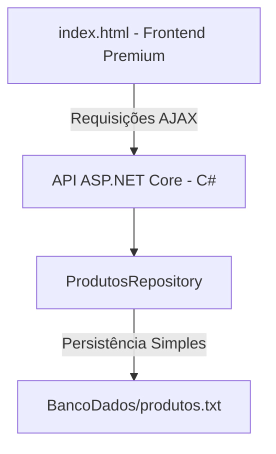

📦 Controle de Estoque Inteligente

Seja muito bem-vindo ao **Controle de Estoque Inteligente! 🚀

Este é um sistema desenvolvido para tornar o gerenciamento de produtos em estoque algo simples, visualmente agradável e altamente eficiente. Projetado com uma estética moderna *Dark Glassmorphism* (efeito de vidro fosco em fundo escuro) e micro-animações fluidas, o sistema oferece uma experiência de uso premium, unindo um backend robusto em C# a uma interface web super responsiva.

Além disso, o sistema conta com suporte completo a múltiplos idiomas (**Português, Inglês e Espanhol**) com tradução dinâmica instantânea e formatação de moedas localizada.


 💡 O Propósito do Projeto

Este projeto foi desenvolvido com foco 100% no gerenciamento inteligente de mercadorias. O objetivo é fornecer uma ferramenta ágil e direta para o monitoramento de inventários em tempo real, sem telas burocráticas ou fluxos complexos. Focamos no que realmente importa para a gestão do dia a dia: **agilidade, clareza visual dos níveis de estoque e facilidade de operação.**


🌟 Principais Funcionalidades

### 1. Painel de KPIs Dinâmico (Métricas)
Logo no topo do sistema, você tem um raio-x em tempo real do seu estoque:
*   **Total de Produtos:** Quantidade de itens cadastrados.
*   **Valor do Estoque:** Avaliação financeira somada de todos os itens do inventário.
*   **Estoque Baixo:** Alerta em amarelo para produtos com 5 unidades ou menos.
*   **Fora de Estoque:** Alerta vermelho destacando itens esgotados.

2. Gerenciamento Completo de Produtos
*   Cadastro de produtos com Código de Barras/SKU, Categoria, Nome, Descrição detalhada, Preço Unitário, Quantidade Inicial e Localização física no galpão (Ex: *Prateleira B, Corredor 3*).
*   Edição simples e exclusão rápida.
*   Busca inteligente por texto (filtra por nome, código ou descrição) integrada a um filtro por categorias.

3. Movimentações Rápidas e em Lote
*   **Ajuste Rápido (clicks de 1 em 1):** Botões de `+` e `-` diretamente na linha do produto para dar entradas ou baixas imediatas com um só clique.
*   **Ajuste em Lote (Movimentação):** Ao clicar sobre o número da quantidade, abre-se uma janela para registrar a entrada ou saída de maiores quantidades de uma só vez.

4. Sistema I18N (Tradução Instantânea)
Desenvolvemos um seletor visual na barra superior que permite alterar todo o sistema instantaneamente para:
*   🇧🇷 **Português (PT):** Moeda formatada em Real (`R$ 0,00`).
*   🇺🇸 **English (EN):** Moeda formatada em Dólar (`$0.00`).
*   🇪🇸 **Español (ES):** Moeda formatada em Euro (`0,00 €`).
*   *As preferências de idioma ficam salvas no navegador!* Mesmo que você feche a página, ela lembrará da sua escolha na próxima vez.

---
🛠️ Detalhes Técnicos e Arquitetura

O projeto é dividido de forma limpa entre uma API e um Frontend leve:



*   **Frontend (Interface):** Desenvolvido com HTML5 semântico, estilização personalizada em CSS vanilla (com variáveis de design e efeitos de desfoque de fundo), jQuery para manipulação dinâmica e Bootstrap para suporte estrutural estruturado.
*   **Backend (API C#):** Construído sobre o ASP.NET Core (.NET 6). O namespace principal é `ControleEstoque`.
*   **Persistência (Banco de Dados):** Pensado para rodar de imediato sem que você precise instalar SQL Server ou Docker. Os dados são salvos em formato estruturado em um arquivo de texto plano localizado em `BancoDados/produtos.txt`. A gravação é concorrente e segura.

---

 🚀 Como Executar o Projeto Localmente

 Pré-requisitos
*   [.NET SDK 6.0](https://dotnet.microsoft.com/download/dotnet/6.0) (ou superior) instalado na sua máquina.
*   Um navegador de internet moderno.

Passo 1: Iniciar o Servidor C# (Backend)
1. Abra o terminal (PowerShell ou Command Prompt) na pasta raiz do projeto.
2. Navegue até a pasta do projeto C#:
   ```powershell
   cd ControleEstoque
   ```
3. Execute a API:
   ```powershell
   dotnet run
   ```
4. O servidor iniciará e começará a escutar requisições de API no endereço padrão configurado: `https://localhost:44344`.

 Passo 2: Executar a Interface (Frontend)
1. Dê um duplo clique no arquivo `index.html` na pasta `ControleEstoque` para abri-lo diretamente no navegador.
2. *Pronto!* A página se conectará automaticamente à API rodando localmente para carregar e salvar seus dados.

---

📁 Estrutura de Pastas Principal

```text
ControleEstoque/
├── BancoDados/          # Onde o arquivo de texto produtos.txt é salvo automaticamente
├── Controllers/         # ProdutosController.cs (rotas de salvar, listar, alterar e deletar)
├── Models/              # Modelo Produto.cs e o Repositório de Persistência
├── Properties/          # launchSettings.json (portas SSL e profiles de inicialização)
├── resources/           # Scripts javascript (jQuery, Bootstrap) e estilos globais
├── index.html           # Página web principal com estilizações dark e lógica I18N
├── ControleEstoque.sln  # Arquivo de solução do Visual Studio
└── README.md            # Este arquivo que você está lendo agora!

Desenvolvido com carinho para simplificar sua rotina. 📦✨

